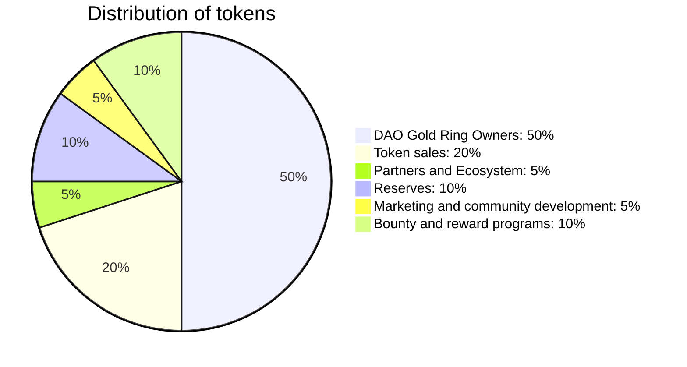

## Introduction

We represent **999** members of the elite united by one idea. We speak our own language and wear our symbols - golden **NFT** rings. Passports, queues, borders, bureaucracy, meaningless rules and degrading laws, banks - all this is the past. We start with marriages, uniting people in pairs without dividing the world of people into countries. We are and have always been one people and we see the failure and uselessness of the old order.

The **NFT** concept of the registry office [DAO 999 NFT](https://www.xdao.app/137/dao/0x8e7b1334d184c04B2DAc1dfF03F7fE290e5A5a47) is inspired by the combination of modern technology and traditional values. It is based on the idea of creating unique digital assets that can be used for vital records such as weddings.

Digital registry office operated by a decentralized autonomous organization [DAO 999 NFT](https://www.xdao.app/137/dao/0x8e7b1334d184c04B2DAc1dfF03F7fE290e5A5a47).

The idea for this project came from a desire to create a new way of registering vital records using blockchain and **NFT** technologies.

The **NFT** concept of the registry office [DAO 999 NFT](https://www.xdao.app/137/dao/0x8e7b1334d184c04B2DAc1dfF03F7fE290e5A5a47) is a combination of traditional and modern in art, technology and world order.

What unites us is an idea, a fairy tale. We are building ** Far Far Away ** and we are open source code. Our system is transparent to everyone.

An oak tree with golden rings around its trunk will become a visual metaphor for the family tree of the **Far Far Away** dynasty.

In our vision of the future, technology becomes the key to creating new, decentralized structures of power and public administration. Instead of simply replacing old institutions, we propose using technology to create something new and better - a decentralized, transparent and open society where every person has a voice and every opinion counts.

We want to create a new universe where physical limitations disappear and everything is limited only by your imagination. It is a place where people are free to interact with each other, party, get married, do business, and participate in the regulation of this universe.
Ultimately, our goal is to create a place where people can live, work and enjoy life, regardless of their physical location in the real world. This is a visionary goal, but we are confident that with the help of technology we can make it a reality.

Join the **Far Far Away** where we combine love and technology!

## Gold rings

**Far Far Away** gold rings are not just **999** gold wedding rings with a unique **585** assay font. It is a crossroads between the ancient art of goldsmithing and modern blockchain technology. These are not just ordinary gold rings, but the historical heritage of folk tales, turned into a digital form. They are a combination of real and virtual fairy-tale world, reflecting the progressive trends of our time. Along with the gold ring, you get **NFT**, which is unique, cannot be counterfeited, and has an increasing value as its price rises with each round of investment. This token is a governance token, an additional digital asset associated with **Far Far Away**. It gives you the ability to manage the **Far Far Far Away** ecosystem. Plus, when you buy a **Far Far Away** gold ring, you also get **0.5** of **$ZLATO** tokens

:::info

- The rings are made of **585** gold, which guarantees their quality and value.
- Each ring has an associated **NFT**, which is the unique identification of the ring in the digital world.
- This ring is part of a large ecosystem known as **Far Far Away**, and gives the owner the right to control this ecosystem.
- When you buy a ring, you also get **0.5** of **$ZLATO** token, which supposedly has additional value in this ecosystem or market.
- Access to a closed community of investors.

:::

## $ZLATO

This is a **Far Far Away** token with a total of **999**. It is a blockchain-based digital currency that provides additional features and benefits to owners of **Far Far Away** gold rings. The **$ZLATO** token can be used within the **Far Far Away** platform to purchase additional services and products. You can also exchange the **$ZLATO** token for other cryptocurrencies or use it for further investments.

Yes, each **Far Far Away** gold ring is not only a unique piece of jewelry, but also a digital certificate to one of the **999** royal lands in the **Far Far Away** metaverse. This is part of a magical world where you will find additional opportunities and great adventures within the blockchain ecosystem.

When you purchase a **Far Far Away** gold ring, you not only become the owner of a beautiful gold piece of jewelry, but also a digital asset that gives you access to your own royal land in the blockchain world.

::: info
It's like a key to a magical box that holds additional features and treasures.
:::

## Metaverse Far Far Away

On the royal land, you will be able to participate in the management of the **Far Far Away** Kingdom, make decisions, vote and influence the development of this amazing world. You will have access to unique features, offers and benefits that add value and functionality to your ring ownership.

Don't miss your chance to enter **Far Far Away** and become king or queen of your own land. Your golden ring will not only be a symbol of luxury and beauty, but also a gateway to the magical world of blockchain, where each owner of **Far Far Away** has a special place and opportunities.

**Far Far Away** rings are unique and cannot be counterfeited thanks to the use of blockchain technology. Each ring has its own unique digital footprint in the form of **NFT**, which is recorded and stored on the **Ethereum** blockchain. This provides transparency and authenticity, allowing you to be confident in the uniqueness of your asset.

## Two-Piece Gold Ring

Each of these rings is a real masterpiece of craft! What makes them truly unique is the two pieces woven together like the links of a miniature machine. The inner part easily spins around the base, as if creating an invisible connection between the worlds.

Each two-piece gold ring of **Far Far Away** is a true miracle of technology and a mystery contained in brilliant gold. It reminds us of the power and the beautiful combination of goldsmithing tradition and the innovative ideas of cryptocurrencies. It is like a magical fusion of the past and the future, where the splendor of gold is intertwined with technological possibilities.

One of the main features of **Far Far Away** rings is their price increase mechanism every investment round. This means that the value of your ring automatically increases over time, making it not only a great piece of jewelry, but also a valuable investment asset. You get the opportunity to own value that grows in value.

All these unique aspects make **Far Far Away** rings special. Not only do you get a beautiful and valuable gold ring, but you also enter a new era of investment and the digital economy. Your assets take on a new level of value and opportunity thanks to the penetration of blockchain and **NFT** into the world of precious metals.

## Is it really a valuable investment?

Definitely one of the most unique investment opportunities today. Gold has always been a stable asset and **NFT** is rapidly gaining popularity as a form of digital art and value. With Far Far Away\*\* you get the best of both worlds.

Gold, as a precious metal, has a long history of being a valuable asset that retains its value over time. It is a universal means of exchange and storage of value. With **Far Far Away** you get a real **585** gold ring that not only has aesthetic appeal, but also represents the value associated with the precious metal.

**Far Far Away** is not only an investment in real gold and a digital asset, but also an opportunity to become part of a closed community of investors.

Together with other members of **Far Far Away**, you get access to exclusive events, chats, where you can share your ideas, experiences and strategies.

Here you will find like-minded people who share your vision and interests in the field of investment. In the closed community of **Far Far Away** you will be able to discuss the latest trends and investment prospects, get valuable advice from experienced members and create valuable connections in the investment world.

It's not just about buying and owning assets, it's a privilege to be part of a community that brings together people who strive to grow, innovate and achieve financial goals. All participants of **Far Far Away** appreciate the true value of investments and strive for mutual support and success.

So, by joining **Far Far Away**, you not only receive investment assets, but also become part of a prestigious community where you can exchange ideas, learn from the experience of others and develop your investment skills. This is an opportunity to enter a world where knowledge, experience and interaction between investors are valued, as well as the opportunity to reach new financial heights together with the **Far Far Away** community.

## Why invest now?

Now is the perfect time, as the price of the **Far Far Away** gold ring automatically increases every investment round, making it especially attractive to buy right now. This means that by purchasing a **Far Far Away** gold ring, you will be able to take advantage of its rapidly rising value. Investing early can bring you significant returns in the future.

With the rapid development of the market and the limited supply of only **999** tokens, investing now provides you with a unique opportunity to acquire a valuable asset that can become a valuable legacy or bring you significant financial benefits.

## What are the risks?

Like all investments, buying **NFT** and gold involves certain risks and at the same time, thanks to the unique pricing system of **Far Far Away** rings, where the value of the ring increases over time, and the receipt of additional **$ZLATO tokens **, these risks can be significantly reduced.
Investments in **NFT** and gold may be subject to market fluctuations and changes in demand. However, at **Far Far Away** we offer an innovative price increase mechanism that allows your ring to increase in value every investment round. This creates additional opportunities for the growth of your investment asset.

:::info
As with any investment, capital losses are possible. Investing in the **Far Far Away** gold ring also offers you a **0.5** **$ZLATO** token out of a total supply of **999**, which can further reduce your risks. The **$ZLATO** token has a limited supply and is linked to the cryptocurrency rate, providing you with potential added value.
:::

The possibility of a change in the market price of gold and **NFT** cannot be ruled out. However, our **585** gold ring has real value based on world standards. The combination of the golden ring and **NFT** allows you to have two assets in one, which contributes to diversification and risk reduction.
It is important to understand that investments are always associated with risks, and each investor must independently assess their readiness for them.

:::warning
We always recommend that you seek the advice of professional financial advisors in order to make an informed investment decision.
:::

We strive to provide maximum transparency and information to our clients. We invite you to familiarize yourself with the detailed information about the risks associated with **Far Far Away** and carefully study the documentation before making an investment decision. It is important to be aware and make decisions based on your own analysis and careful risk assessment.

## Mobile application 999

The **999** mobile app idea promises to revolutionize the traditional world of investment, wedding ceremonies and asset management. It is a decentralized mobile application that uses blockchain technology and the concept of **NFT** to provide users with the ability to buy gold wedding rings, make alliances on the blockchain, stake tokens, and participate in project management.

The main features of the application:

1. **Purchasing a gold ring:** This is the initial stage of the user's interaction with the application. Each ring is not only a unique physical decoration, but also an NFT corresponding to it, which adds additional value to the purchase.

2. **Closed Club:** Purchasing a ring gives you access to an exclusive in-app social network. Here, users can find a pair for a blockchain union or participate in private events.

3. **Koschei - AI Advisor:** This is a unique feature where artificial intelligence trained on folk tales gives wise advice to users along the way and leads to immortality.

4. **Staking:** Users can stake their **$ZLATO** tokens and earn interest. This is a way to increase your investments and an additional source of income.

5. **Government:** Due to the decentralized structure of the application, ring owners have the ability to manage the project. They can vote on various proposals or contribute their own ideas.

This application represents not only a revolution in the field of investments, but also a new approach to social connections and management. It offers users the opportunity to become not only investors, but also active participants in the project, thus ensuring their involvement and satisfaction.

## Why should you trust us?

We have a deep understanding of the world of gold and **NFT** technology. We have all the necessary knowledge and experience to provide you with a high quality product and secure interaction.
We, the **Far Far Away** team, have deep knowledge not only in the world of precious metals, but also in the field of cryptocurrencies and blockchain technology. We understand how to combine these two worlds to provide a unique and valuable product for our customers.

All gold rings are made from **585** gold. We monitor quality at every stage of production to make sure you get a ring that is worth the price.

Our **NFT** is based on the **Ethereum** blockchain, one of the most stable and proven cryptocurrency platforms. We use smart contracts to create and transfer **NFTs**, ensuring complete transparency and security for our users.

In addition, we offer a unique price increase mechanic and the opportunity to receive **0.5** **$ZLATO** tokens from a total supply of **999** tokens, which makes our product even more attractive to investors.

We are confident in the quality of our offer and strive for open and honest communication with our customers. We are always ready to answer any questions and provide support at every stage of the process.

## How does the buying mechanism work?

When you decide to purchase **Far Far Away** gold rings, the process begins with purchasing the **NFT** itself. You make a purchase, receiving a unique digital asset in the form of **NFT**, which confirms your ownership of this gold ring.

After completing the purchase of **NFT**, we provide you with the opportunity to contact our administrator. You will be able to provide a shipping address where we will ship your gold ring to. We pay special attention to your privacy and security, so all information is transmitted and processed in a secure manner.

This **NFT** is then sent to your wallet address on the **Ethereum** blockchain, where it can be stored, freely traded or transferred. This gives you complete control over your digital asset.

This whole process is transparent and automated, thanks to the openness of blockchain technology, which ensures security and convenience at every step.

## Monetization

**Far Far Away** digital gold rings are not just symbols of your unions - they have a real physical equivalent. Each NFT ring not only symbolizes your union, but also confirms your right to own a real gold ring.

We cooperate with jewelers by offering images of their products in our marketplace. The token of each ring indicates your right to own the physical equivalent.

## Community

We strive to create an active and engaged community around **Far Far Away**. To increase the social capital of each user, we have developed a number of quests: subscribing in social networks, telling friends about us, creating creative content, etc. For completing these tasks, ambassadors will receive our internal **$ZLATO** token, which they can use to buy rings or sell on the exchange.

## Tokenomics of $ZLATO

Our tokens are divided into four types:

1. **DAO 999 NFT** Collection Gold Ring: The **NFT** Gold Ring is a governance token. This confirms membership in the **DAO 999 NFT** (Decentralized Autonomous Organization) and entitles members to create and vote on proposals. They are important for participating in community governance and influencing the future of our project. Total quantity: **999** pieces
2. Ring from the **Ambassador** collection: **NFT** ring is a token for entering the application and the status of a project ambassador, as well as participation in the **$ZLATO** token airdrop. Total quantity: **999** pieces
3. **User** collection ring: The real gold **NFT** ring is the application login token. Multiple series of **999** pieces
4. Local currency: **$ZLATO** serves as the local currency on our platform. This token is used to make all payments in the ecosystem, including the purchase of **NFT** rings and other in-app transactions, and allows you to determine how much money the liquidity provider should receive during the distribution of dividends.

The total supply of funds is **999** **$ZLATO** tokens. The distribution of tokens is determined based on each round of funding. Here are some preliminary details:

Total number of tokens: **999**:

1. DAO gold ring owners: 50% (499.5) - this is the share of tokens that will be given to ring owners.
2. Token sales: 20% (199.8) is the number of tokens that will be put up for public sale for public purchase. This will enable a wide range of investors to participate in the project and make their contribution.
3. Partners and ecosystem: 5% (49.95) - this part of the project team and advisors will be used to support partnerships, stimulate the development of the ecosystem and collaborate with other projects and platforms.
4. Reserves: 10% (99.9) - will be held in reserve to maintain liquidity, conduct future funding rounds and manage unexpected events.
5. Marketing and community development: 5% (49.95) - will be used for marketing activities, PR, project promotion, and community development and support.
6. Bounties and Reward Programs: 10% (99.9) - This portion of tokens will be used for bounty programs, which may include token rewards, bounties, airdrops and other incentives for community members.

In this way, our tokenomics ensures active user participation in the community, keeps our ecosystem functioning, and encourages continued engagement with our platform.

## Public sales of $ZLATO

At the center of our tokenomics is the **$ZLATO** cryptocurrency with a total supply of **999** tokens. The value of the **$ZLATO** token and **NFT** DAO Rings will increase as each new round of investment begins, starting from 2 TH.

According to our development plan, we plan to sell only 20% of our **$ZLATO** tokens, which is 199.8 tokens.

| Round name      | Price $ZLATO (in ETH) |
| --------------- | --------------------- |
| Strawberry Moon | 2                     |
| Deer Moon       | 3                     |
| Sturgeon Moon   | 4                     |
| Blue Moon       | 5                     |
| Harvest Moon    | 6                     |
| Hunting Moon    | 7                     |
| Beaver Moon     | 16                    |
| Cold Moon       | 28                    |

We are also introducing the **$IGLA** micro-unit, similar to the "satoshi" in bitcoin, making our token more accessible and usable in microtransactions. **$IGLA** will be the smallest unit of **$ZLATO** and will be equal to 0.00000001 **$ZLATO**

::: info
**1 $ZLATO** = **1,000,000 $IGLA**
:::

## Cost of DAO Gold Rings

Introducing the exclusive **NFT** DAO Ring Collection of just **999** unique pieces. Each ring in this limited edition is crafted from **585** gold and features an original design that includes a rotating inner element.

The peculiarity of this collection lies in the unique pricing mechanism. The cost of each **NFT** DAO ring is expressed in Ethereum and changes in proportion to the value of the **$ZLATO** token at various stages of IDO:

|   Round name    | Ring Cost (ETH) | Number of Rings | Total Cost (ETH) |
| :-------------: | :-------------: | :-------------: | :--------------: |
|    New Moon     |      0.05       |       10        |       0.5        |
| Strawberry Moon |        1        |        9        |        9         |
|    Deer Moon    |       1.5       |       18        |        27        |
|  Sturgeon Moon  |        2        |       26        |        52        |
|    Blue Moon    |       2.5       |       34        |        85        |
|  Harvest Moon   |        3        |       44        |       132        |
|  Hunting Moon   |       3.5       |       53        |      185.5       |
|   Beaver Moon   |        8        |       305       |       2440       |
|    Cold Moon    |       14        |       500       |       7000       |
|                 |    **Total**    |     **999**     |     **9999**     |

**The total cost of all rings is 9999 ETH**

We invite you to invest in our unique project and become part of our community. Your investment will not only help support our commitment to building the project, but will also provide you with exclusive privileges and opportunities as a gold **NFT** DAO ring owner.

## Vesting

In order to provide long-term commitment to investors, tokens can be subject to an vesting schedule. This will mean that the tokens will be provided to investors gradually, and not all at once. For example, tokens can be transferred within 2 years, with 25% of the tokens issued every 6 months.
Tokens can be distributed to investors through a smart contract or a third party platform such as a cryptocurrency exchange or crowdfunding platform.

## Roadmap - Development Plan

### Q2 2023: Preparing the MVP

- Platform branding and creation of a **NFT**-collection of **999** rings.
- UX design of the marketplace.
- Development of a platform and smart contracts for marriages and monetization of NFT rings.
- Agreements with jewelry manufacturers and the signing of the first contracts.
- Private sales of $ZLATO cryptocurrency.

### Q3 2023: Alpha tests, start of marketing

- Creation of a community in Telegram, Twitter and Discord.
- Preparation of the first creatives in cooperation with artists and jewelers.
- Involving users in the passage of quests.

### Q4 2023: Beta testing, marketing

- Connection of digital user profiles and identification.
- Launching a contest for creating custom creatives and filling digital profiles.
- Airdrops, launch of the referral program.
- Preparation of articles, publications, PR plan, interaction with influencers and the media.
- Listing of the **$ZLATO** token on cryptocurrency exchanges.

### Q1 2024: Launch of MVP, expansion of functionality

- Creation of a dating module.
- Expanding the functionality of digital user profiles.
- Integration with the party and ticketing module.
- Offline advertising campaign to attract new jewelry suppliers.

### Q2-Q4 2024: Development of the metaverse

- Modeling and visualization of digital avatars for users.
- Development of the game engine, game mechanics and UX/UI.
- Integration with smart contracts.
- Alpha testing of the metaverse.

## Value propositions:

The [DAO 999 NFT](https://www.xdao.app/137/dao/0x8e7b1334d184c04B2DAc1dfF03F7fE290e5A5a47) Metaverse offers its consumers several unique value propositions, including:

## Consumer segments.

The main consumer segments of the metaverse [DAO 999 NFT](https://www.xdao.app/137/dao/0x8e7b1334d184c04B2DAc1dfF03F7fE290e5A5a47) are clubbers, promoters and event organizers who are interested in owning and trading in-game assets, as well as in unique and collectible \* \*NFT\*\*.

## Value propositions:

The [DAO 999 NFT](https://www.xdao.app/137/dao/0x8e7b1334d184c04B2DAc1dfF03F7fE290e5A5a47) Metaverse offers its consumers several unique value propositions, including:

- **Decentralized approach to communities and interactivity**: The use of blockchain technology allows users to communicate and interact in a decentralized manner that respects their privacy and autonomy.

- **Digital Alliances and Commitments**: Our project allows users to enter into "marriages" or unions, which are then recorded on the blockchain. This creates a new level of commitment and interaction in the digital space.

- **Creative Freedom and Expression**: Users can create and share unique NFT collections, allowing them to express their individuality and uniqueness.

- **Participation in the digital state**: Users can actively participate in the development of the project by voting for proposals and submitting their ideas.

- **Digital Economy and Tokenomics**: Using the internal currency **$ZLATO** allows users to participate in the project economy, earn and spend tokens on various services and goods.

- **Metaverse**: The planned creation of the Metaverse offers users a new level of interactivity and involvement, allowing them to interact in a fully digital environment.

## Sales channels:

Metaverse [DAO 999 NFT](https://www.xdao.app/137/dao/0x8e7b1334d184c04B2DAc1dfF03F7fE290e5A5a47) belongs to the owners of **999** **NFT** and will be sold through the online payment platform [OpenSea](https:// opensea.io/999kingdom). The project will also be promoted through digital marketing campaigns, social media and community building efforts.

## Customer relations:

Metaverse [DAO 999 NFT](https://www.xdao.app/137/dao/0x8e7b1334d184c04B2DAc1dfF03F7fE290e5A5a47) will maintain a close relationship with its customers through regular communication, community building efforts, and providing excellent customer support with premium concierge service. The project will also collect feedback from its customers on a regular basis to ensure that it meets their needs and delivers on its value proposition.

## Income streams:

The Metaverse [DAO 999 NFT](https://www.xdao.app/137/dao/0x8e7b1334d184c04B2DAc1dfF03F7fE290e5A5a47) will generate income through various streams, including:

- Sell **NFT**
- Cryptocurrency trading **$ZLATO**
- Commissions for in-game transactions
- Advertising and sponsorship

## Key resources:

Talented and experienced team of club promoters, developers, designers and marketers.
Secure and scalable blockchain platform.
Large and active club community.
Strong partnerships with key players in the club community and the blockchain industry.

## Key activities:

[DAO 999 NFT](https://www.xdao.app/137/dao/0x8e7b1334d184c04B2DAc1dfF03F7fE290e5A5a47) main events of the metaverse include:

- Development and maintenance of platform gamification and creation of a useful mobile application and website.
- Marketing and community building efforts to attract and retain customers.
- Continuous development and implementation of new features and improvements.
- Creating and maintaining partnerships with key players in the club and blockchain industry.

## Key Partners:

[DAO 999 NFT](https://www.xdao.app/137/dao/0x8e7b1334d184c04B2DAc1dfF03F7fE290e5A5a47) metaverse key partners include:

- Investment funds.
- Club promoters and event organizers.
- Sponsors and advertisers.

## Cost structure:

The main costs of the metaverse project [DAO 999 NFT](https://www.xdao.app/137/dao/0x8e7b1334d184c04B2DAc1dfF03F7fE290e5A5a47) will include:

- Costs for the development and maintenance of the platform and mobile application.
- Marketing and community building costs.
- Operating expenses, including salaries and employee benefits.
- Costs associated with creating and maintaining partnerships.
- Compliance costs for legal and regulatory requirements.

## Project author

The author of the **Far Far Away** project - [Dmitry Vasiliev](https://www.bit.ly/cv_vasilev_dmitrii) - is a well-known specialist in his field, recognized for his contribution to the development of the technology community and possessing a number of important skills and experience.

**Expert in React Native and AWS Amplify**
The author is the creator of the first React Native and AWS Amplify course on Runet and a member of Amazon's AWS Community Builders program.

**Active community member**
He actively shares knowledge through various platforms, including a blog on dev.to, articles on itnext.io and on Habré.

**Wide range of technical skills**
He has a wide range of technical skills in his arsenal, including the use of React Native, Apollo, Redux, GraphQL, as well as managerial skills in the field of project management and creation of crypto projects.

**Create an MVP**
The author has excellent skills in creating minimum viable products (MVP), including rapid prototyping, implementation of important features and bringing the product to market in the shortest possible time.

**Experience in development and management of IT projects**
His extensive experience in the development and management of a variety of IT projects includes work on gaming applications, educational platforms and mobile applications for financial institutions.

**AI application**
The author actively uses artificial intelligence to improve mobile applications and websites.

**Organization and development of the crypto community**
His successful track record of organizing and growing the crypto community in Thailand proves his ability to mobilize and motivate others.

**Professional experience in cryptocurrencies and blockchain**
He has deep skills in the field of cryptocurrencies and blockchain technologies and has worked on the development of mobile applications for the blockchain payment system.

**Implementation of best practices**
The author implements best practices and adheres to high quality standards in his work.

**Training and knowledge transfer**
Proactively shares knowledge and experience through publications, training courses and other platforms.

**Team management**
He is ready to assemble and manage a team of professionals for projects of any complexity.

**All these skills and experience make him the perfect leader for our project.**

## Question answer:

### I'm not sure about blockchain technology. She seems complex and unstable.

I understand your concerns, but the blockchain is not something complicated or unstable. It is simply a technology that allows transactions to be carried out safely and securely. Our **Far Far Away** gold rings are backed by gold and crypto making them a stable asset despite the volatility of the crypto market.

### I'm not sure if it's worth investing in gold rings or NFTs.

Your doubts are understandable. However, **Far Away** is not just a gold ring or **NFT**. This is a digital asset, the value of which increases with each round of investment and which gives you the opportunity to get **0.5** of **$ZLATO** tokens. This is a unique investment product that combines traditional and modern forms of assets.

### I think this is too good to be true. Why don't you just sell gold rings?

We want to offer something more than just a gold ring. **Far Far Away** Golden Rings are an opportunity to invest in the future of blockchain technology and be part of a new kind of economy. This is more than just a ring - it is a sign of participation in the new world of finance.

### I'm not sure I want to mess with cryptocurrencies.

You are not just buying a cryptocurrency, you are buying an asset that mixes a real tangible asset - gold - with a digital asset in the form of **NFT** and the **$ZLATO** token. This is a way to diversify your portfolio and explore new investment opportunities.

### I'm afraid of losing my investment if something goes wrong.

We understand your concerns. Investing is always associated with some risk. However, **Far Far Away** was designed to minimize these risks. Your investment is backed by a real **585** gold ring and a **$ZLATO** token limited to **999** tokens, making it a relatively stable asset.

### I'm not sure I want to invest in cryptocurrencies, especially new ones.

This is not just an investment in a new cryptocurrency, it is an investment in a golden ring and in a share of the **$ZLATO** cryptocurrency. The **NFT** Golden Ring of **Far Far Away** is a combination of real and digital asset, representing a unique and innovative investment proposal.

### I'm not sure if this is legal.

All our operations are fully compliant with the law. We operate in accordance with digital asset laws and always try to be at the forefront of regulatory changes in the field of cryptocurrencies.

### This seems too complicated for me.

We understand that the concept of **NFT** and cryptocurrencies can be a little tricky. But our team is here to make the process as easy as possible. We provide all the guidance and support you need to help you every step of the way.

### I think this is too good to be true.

We understand your doubts, because the world of cryptocurrencies is full of promises of quick riches. But **Far Far Away** is not just a fleeting trend. This is a thoughtful and well designed product that offers real value. And besides, your investment includes a **585** gold ring, which in itself already represents a certain value.

## To the Moon!!!

In the world of cryptocurrencies, there is often talk about the value of a limited supply. That is why we are proud to present you the **NFT** **Far Far Away** Gold Ring, a unique gold ring with unparalleled added blockchain value.

The true power of the golden ring **Far Far Away** lies in its connection with **$ZLATO**. Gold is limited to just **999** tokens, making each token extremely valuable. With the purchase of the **Far Far Away** gold ring, you will receive **0.5** of **$ZLATO** token, part of a limited offer, which makes it even more attractive to own the ring.

With each round of investment, your **Far Far Away** gold ring gains more and more value. It's not just a decoration, it's your passport to the world of Web 3.0. This kind of opportunity is rare, it's like finding a gold mine during a gold rush. Therefore, do not miss your chance and invest in the future with **Far Far Away**. Buy gold rings now before it's too late!
Combining real gold and digital assets, we offer you the aesthetic pleasure of wearing an exquisite double gold ring. Don't miss your chance to experience this double effect and be part of this unique offer!
Enjoy the taste of luxury with **Far Far Away**. Buy now and join a community that is actively shaping the future!

