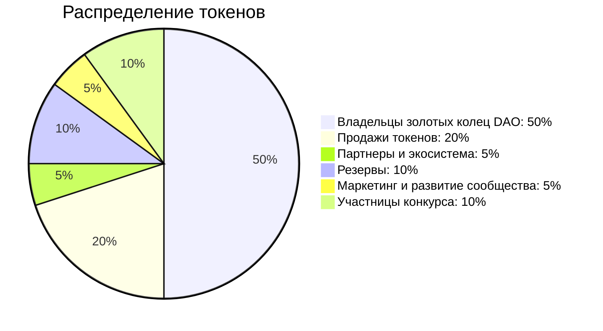

import YouTube from 'react-youtube'

<YouTube videoId="mEwfJaM22ss" />

## Введение

**Тридевятое царство** - это банк бессмертных, хранилище вечности и конкурс красоты.

Инновационное приложение, созданное с использованием самых передовых технологий искусственного интеллекта. Основная миссия этого приложения - стать хранилищем бессмертия для всех желающих.

Приложение служит виртуальным хранителем знаний и воспоминаний каждого пользователя. Оно анализирует поведение, интересы, привычки и взаимодействия пользователя, после чего формирует цифровой отпечаток личности, который будет сохраняться и обновляться на протяжении всей жизни пользователя.

Особенность этого приложения - его доступность для всех желающих. Каждый, кто желает стать частью **Тридевятого царства**, получает доступ к неограниченным возможностям цифрового бессмертия.

Благодаря этому приложению, пользователи могут оставить после себя нечто большее, чем просто воспоминания. Они оставляют после себя цифровую легенду - вечный след своей жизни, запечатлённый в **Тридевятом царстве**.

**Тридевятое царство** не просто сохраняет цифровой отпечаток личности пользователя, но и может вести диалоги и общаться с другими, воспроизводя стиль общения и мысли пользователя. Это делает приложение более персонализированным и интерактивным.

К тому же, **Тридевятое царство** может предложить функцию виртуального дневника, где владелец может рассказывать о своих мыслях, эмоциях, идеях или событиях, которые он хочет сохранить. ИИ будет анализировать и сохранять эти данные, создавая еще более точное представление о личности владельца.

При добавлении реалистичных 3D-изображений и технологий виртуальной реальности, пользователи смогут визуализировать свою "бессмертную" личность, встречаться и общаться в виртуальном пространстве, даже после того, как они покинули реальный мир.

В зависимости от технологического развития и потребностей пользователей, **Тридевятое царство** всегда сможет обновляться и адаптироваться, обеспечивая своим пользователям истинно вечный опыт.

В **Тридевятом Царстве**, волшебство сказок становится реальностью. Это пространство, где **Золушка** превратится в принцессу. Сказка былью станет, в эпоху цифровых технологий в конкурсе красоты **Мисс Блокчейн**.

Так начинается путь к величию, на протяжении его они могут стать одной из **999** принцесс, что будут избираться каждый год, по одной, на протяжении **999** лет. И однажды принцесса станет королевой, заключив союз в смарт-контракте **NFT** загса **Тридевятого Царства**.

Цифровой загс, управляемый децентрализованной автономной организацией [DAO 999 NFT](https://www.xdao.app/137/dao/0x8e7b1334d184c04B2DAc1dfF03F7fE290e5A5a47) вдохновлен сочетанием технологий и традиционных ценностей. Основан на идее создания уникальных цифровых активов **NFT**, что будут использованы для записи актов гражданского состояния, таких как свадьбы.

Дуб с золотыми кольцами вокруг его ствола станет визуальной метафорой генеалогического древа королевской династии **Тридевятого царства**.

## Конкурс красоты Тридевятого Царства

Владельцы золотых колец **Тридевятого Царства** - жюри этого сказочного конкурса красоты выбирают тех, кто будет достоин носить золотую диадему **Мисс Блокчейн** и титул **Принцесса Тридевятого Царства**.

В нашем видении будущего, технологии становятся ключом к созданию новых, децентрализованных структур власти и общественного управления. Вместо того чтобы заменить старые институты, предлагаем использовать технологию для создания децентрализованного открытого общества, где каждый человек контролирует свой голос и выбор.

Добро пожаловать в **Тридевятое Царство**, мир, где мечты воплощаются в реальность, и красота является неотъемлемой частью нашей сказочной действительности. С гордостью представляем наш децентрализованный конкурс красоты - **Мисс Блокчейн**, платформу, где каждая участница является вдохновителем **999 летней истории королевской династии Тридевятого царства**.

## Титул участниц конкурса

### Золушка

Это начальный титул для всех участниц. Как только незамужние женщины, в возрасте от 16 до 35 лет, пройдут квесты [предложенные на платформе Zealy.io](https://zealy.io/c/4736/invite/lyKxhQNYU_Fp7ZiUB9eN-), они становятся **Золушками**. Этот титул подтверждается получением уникального NFT **Туфелька Золушки**. Золушки должны активно участвовать в квестах и заданиях на платформе, чтобы пройти к следующему этапу - кастинг.

### Принцесса

Каждый год может быть отобрано только **27**(9+9+9) золушек для финала конкурса, где владельцы золотых колец **Тридевятого Царства** будут голосовать за своих фавориток. Участница с наибольшим числом голосов становятся победительницей и получает титул **Мисс Блокчейн** и золотую диадему принцессы **Тридевятого Царства**.

### Королева

Принцесса, которая вступает в брачный союз через смарт-контракт на платформе **Тридевятого Царства**, становится **Королевой** и получает дополнительные привилегии, носит **золотое кольцо Королевы** и титул **Её Величество, Королева Тридевятого Царства**

### Царица

**Царица** та, что каждый год выбирается одна из **Королев**, путем голосования среди пользователей платформы. Обладает наибольшим влиянием в **Тридевятом Царстве** и пользуется наивысшими привилегиями, носит **золотую корону Царицы** и титул **Её Величество, Царица Тридевятого Царства**.

:::warning
Нарушение любого из этих правил может привести к дисквалификации.
:::

## Золотые кольца

Золотые кольца **Тридевятого Царства** - это не просто **999** золотых обручальных колец с уникальным шрифтом **585** пробы. Это перекресток между древним искусством золотого дела и современными технологиями блокчейна. Это не просто обычные золотые кольца, а историческое наследие народных сказок, превращенное в цифровую форму. Они представляют собой сочетание реального и виртуального сказочного мира, отражая прогрессивные тренды современности. Вместе с золотым кольцом вы получаете **NFT**, который уникален, не подлежит подделке и имеет возрастающую стоимость, поскольку его цена повышается с каждым раундом инвестирования. Этот токен является токеном управления, дополнительным цифровым активом, связанным с **Тридевятым Царством**. Он дает вам возможность управлять экосистемой. Плюс, при покупке золотого кольца вы также получаете **0.5** токена **$ZLATO**

:::info

- Кольца изготовлены из золота **585** пробы, что гарантирует их качество и ценность.
- Каждое кольцо имеет связанный **NFT**, что является уникальной идентификацией кольца в цифровом мире.
- Это кольцо является частью большой экосистемы, известной как **Тридевятое Царство**, и дает владельцу право управления в этой экосистеме.
- При покупке кольца вы также получаете **0.5** токена **$ZLATO**, который, предположительно, имеет дополнительную ценность в этой экосистеме или на рынке.
- Доступ в закрытое сообщество инвесторов.
- Право голоса за принцессу.

:::

## $ZLATO

Это токен **Тридевятого Царства** с общим количеством **999**. Он является цифровой валютой, основанной на блокчейне, и предоставляет дополнительные возможности и преимущества владельцам золотых колец **Тридевятого Царства**. Токен **$ZLATO** может использоваться внутри платформы **Тридевятое Царство** для покупки дополнительных услуг и реальных золотых колец. Также вы можете обменивать токен **$ZLATO** на другие криптовалюты или использовать его для дальнейших инвестиций.

Да, каждое золотое кольцо **Тридевятого Царства** представляет собой не только уникальное украшение, но и цифровой сертификат к одной из **999** королевских земель в метавселенной **Тридевятого Царства**. Это часть волшебного онлайн и офлайн мира, где вас ждут дополнительные возможности и великолепные приключения.

Когда вы приобретаете золотое кольцо **Тридевятого Царства**, вы становитесь обладателем не только красивого золотого украшения, но и цифрового актива, который предоставляет вам доступ к вашей собственной королевской земле в блокчейн-мире.

:::info
Это как ключ к волшебному ларцу, в котором хранятся дополнительные возможности и сокровища.
:::

## Метавселенная Тридевятое Царство

На королевской земле вы сможете участвовать в управлении **Тридевятым Царством**, принимать решения, голосовать и влиять на развитие этого удивительного мира. Вам будут доступны уникальные возможности, предложения и преимущества, которые дополнят ценность и функциональность вашего владения кольцом.

Не упустите шанс вступить в **Тридевятое Царство** и стать королем своей собственной земли. Ваше золотое кольцо будет не только символом роскоши и красоты, но и вратами в волшебный мир блокчейна, где каждый владелец **Тридевятого Царства** имеет особое место и возможности.

Кольца **Тридевятого Царства** являются уникальными и не подлежат подделке благодаря использованию технологии блокчейна. Каждое кольцо имеет свой уникальный цифровой след в виде **NFT**, который записывается и хранится в блокчейне **Ethereum**. Это обеспечивает прозрачность и подлинность, позволяя вам быть уверенным в уникальности вашего актива.

## Двусоставное золотое кольцо

Каждое из этих колец - настоящий шедевр ремесла! Что делает их по-настоящему уникальными - это две детали, сотканные вместе, словно звенья миниатюрного механизма. Внутренняя деталь легко крутится вокруг основы, словно создавая невидимую связь между мирами.

Каждое двусоставное золотое кольцо **Тридевятого Царства** - это истинное чудо техники и тайна, заключенная в блестящем золоте. Оно напоминает нам о силе и прекрасном сочетании традиций золотого дела и инновационных идей криптовалют. Это как магическое слияние прошлого и будущего, где великолепие золота переплетается с технологическими возможностями.

Одной из главных особенностей колец **Тридевятого Царства** является их механизм повышения цены каждый раунд инвестирования. Это означает, что стоимость вашего кольца автоматически увеличивается с течением времени, что делает его не только прекрасным украшением, но и ценным инвестиционным активом. Вы получаете возможность владеть ценностью, которая растет в цене.

Все эти уникальные аспекты делают кольца **Тридевятого Царства** особенными. Вы получаете не только красивое и ценное золотое кольцо, но и входите в новую эру инвестиций и цифровой экономики. Ваши активы приобретают новый уровень ценности и возможностей благодаря проникновению блокчейна и **NFT** в мир драгоценных металлов.

## Это реально ценное вложение?

Золото всегда было стабильным активом, а **NFT** быстро набирает популярность как форма цифрового искусства и ценности. С **Тридевятым Царством** вы получаете лучшее из обоих миров.

Золото, как драгоценный металл, имеет долгую историю как ценный актив, который сохраняет свою стоимость со временем. Оно является универсальным средством обмена и хранения ценности. С **Тридевятым Царством** вы получаете реальное золотое кольцо **585** пробы, которое не только имеет эстетическую привлекательность, но и представляет собой ценность, связанную с драгоценным металлом.

**Тридевятое Царство** - это не только инвестиция в реальное золото и цифровой актив, но и возможность стать частью закрытого сообщества инвесторов.

Вместе с другими участниками **Тридевятого Царства**, вы получаете доступ к эксклюзивным мероприятиям, чатам, где вы сможете делиться своими идеями, опытом и стратегиями.

Здесь вы найдете единомышленников, которые разделяют ваше видение и интересы в области инвестиций. В закрытом сообществе **Тридевятого Царства** вы сможете обсудить новейшие тренды и перспективы инвестиций, получить ценные советы от опытных участников и создать ценные связи в инвестиционном мире.

Это не просто покупка и владение активами, это привилегия быть частью сообщества, которое собирает вместе людей, стремящихся к росту, инновациям и достижению финансовых целей. Все участники **Тридевятого Царства** ценят истинные ценности инвестиций и стремятся к взаимоподдержке и успеху.

Так что, вступив в **Тридевятое Царство**, вы не только получаете инвестиционные активы, но и становитесь частью престижного сообщества, где вы сможете обмениваться идеями, учиться от опыта других и развивать свои инвестиционные навыки. Это возможность войти в мир, где ценятся знания, опыт и взаимодействие между инвесторами, а также возможность достичь новых финансовых высот вместе с сообществом **Тридевятого Царства**.

## Почему стоит вложиться сейчас?

Сейчас идеальное время, так как цена золотого кольца **Тридевятого Царства** автоматически повышается каждый раунд инвестирования, что делает его особенно привлекательным для покупки прямо сейчас. Это означает, что приобретая золотое кольцо **Тридевятого Царства**, вы сможете воспользоваться преимуществами быстрого роста его стоимости. Раннее вложение может принести вам значительную прибыль в будущем.

С учетом быстрого развития рынка и ограниченного количества - всего **999** токенов, вложение сейчас предоставляет вам уникальную возможность приобрести ценный актив, который может стать ценным наследием или принесет вам значительную финансовую выгоду.

## Какие риски?

Как и все инвестиции, покупка **NFT** и золота включает в себя определенные риски и в тоже время благодаря уникальной системы ценообразования колец **Тридевятого Царства**, где стоимость кольца увеличивается с течением времени, и получением дополнительных токенов **$ZLATO**, эти риски могут быть значительно снижены.
Вложения в **NFT** и золото могут быть подвержены рыночным колебаниям и изменениям спроса. Однако, в **Тридевятом Царстве** мы предлагаем инновационный механизм повышения цены, который позволяет вашему кольцу увеличивать свою стоимость каждый раунд инвестирования. Это создает дополнительные возможности для роста вашего инвестиционного актива.

:::info
Как и с любыми инвестициями, возможны потери капитала. Вложение в золотое кольцо **Тридевятое Царство** также предлагает вам получение **0.5** токена **$ZLATO** из общей эмиссии **999**, что может дополнительно снизить ваши риски. Токен **$ZLATO** имеет ограниченное количество и связан с курсом криптовалюты, предоставляя вам потенциальную дополнительную ценность.
:::

Нельзя исключать возможность изменения рыночной цены золота и **NFT**. Однако, наше золотое кольцо **585** пробы имеет реальную ценность на основе мировых стандартов. Комбинация золотого кольца и **NFT** позволяет вам иметь два актива в одном, что способствует диверсификации и снижению рисков.
Важно понимать, что инвестиции всегда сопряжены с рисками, и каждый инвестор должен самостоятельно оценить свою готовность к ним.

:::warning
Мы всегда рекомендуем обратиться за консультацией к профессиональным финансовым советникам, чтобы принять взвешенное решение о вложении средств.
:::

Мы стремимся обеспечить максимальную прозрачность и информированность наших клиентов. Предлагаем ознакомиться с подробной информацией о рисках, связанных с **Тридевятым Царством**, и внимательно изучить документацию, прежде чем принимать решение об инвестициях. Важно быть осведомленным и принимать решения на основе собственного анализа и тщательной оценки рисков.

## Мобильное приложение 999

Идея мобильного приложения **999** обещает перевернуть традиционный мир инвестиций, свадебных церемоний и управления активами. Это децентрализованное мобильное приложение, которое использует технологию blockchain и концепцию **NFT**, чтобы предоставить пользователям возможность покупать золотые обручальные кольца, заключать союзы на blockchain, стейкать токены и участвовать в управлении проектом.

Основные особенности приложения:

1. **Покупка золотого кольца:** Это начальный этап взаимодействия пользователя с приложением. Каждое кольцо не только уникальное физическое украшение, но и соответствующий ему **NFT**, что добавляет дополнительную ценность покупке.

2. **Закрытый клуб:** Приобретение кольца дает доступ к эксклюзивной социальной сети внутри приложения. Здесь пользователи могут находить пару для блокчейн-союза или участвовать в закрытых мероприятиях.

3. **Кощей - AI:** Это уникальная функция, где искусственный интеллект, обученный на народных сказках, дает мудрые советы пользователям на протяжении всего пути и ведет к бессмертию.

4. **Staking:** Пользователи могут ставить свои токены **$ZLATO**, получая за это проценты. Это способ увеличить свои инвестиции и дополнительный источник дохода.

5. **Government:** Благодаря децентрализованной структуре приложения, владельцы колец имеют возможность управлять проектом. Они могут голосовать за различные предложения или вносить собственные идеи.

Это приложение представляет собой не только революцию в области инвестиций, но и новый подход к социальным связям и управлению. Оно предлагает пользователям возможность стать не только инвесторами, но и активными участниками проекта, обеспечивая тем самым их вовлеченность и удовлетворенность.

## Матрица Тридевятого Царства

Знаешь, как мы рисуем цифры, например, 1, 2, 3, и так далее? Если ты подумаешь, они выглядят как странные картинки, верно? Число один еще можно написать из одной линии, а число 2 не выглядит как две части, правда? Поэтому логика того, как числа изображены и то, чем они являются не соответствует действительности.

Поэтому мы придумали новый способ изображения чисел, которые рисуем внутри трех треугольников, каждый из которых имеет 9 частей. Мы используем эти части, чтобы показать единицы, десятки и сотни.

В этом новом способе, мы можем показать все числа до **999**, что является солнечным полднем на наших часах относительно вашей геолокации, а ноль - это когда солнце в солнечной полночи. Мы рисуем числа по часовой стрелке, как на обычных часах.

Перевернутый треугольник матрицы выбран не случайно, так как децентрализованному миру нужны децентрализованные часы, но самое интересное, что по аналогии мы можем также показать буквы, рисуя их против часовой стрелки. Это как магический компас, который может показывать время, числа и буквы одновременно!

И знаешь что еще забавно? Так как у нас есть и буквы, то мы получаем отображение рта ИИ, через который он может общаться с нами.
Каждый раз, когда он что-то говорит, мы будем видеть, как эти треугольники и их части меняются и двигаются.

## Почему стоит доверять нам?

Мы имеем глубокое понимание мира золота и технологии **NFT**. Мы обладаем всеми необходимыми знаниями и опытом, чтобы предоставить вам высококачественный продукт и безопасное взаимодействие.

Мы, команда **Тридевятого Царства**, обладаем глубокими знаниями не только в мире драгоценных металлов, но и в области криптовалют и технологии блокчейна. Мы понимаем, как сочетать эти два мира, чтобы предоставить уникальный и ценный продукт для наших клиентов.

Все золотые кольца производятся из золота **585**-й пробы. Мы следим за качеством на каждом этапе производства, убедиться, что вы получаете кольцо, которое стоит своей цены.

Наша **NFT** базируется на блокчейне **Ethereum**, одной из самых устойчивых и проверенных криптовалютных платформ. Мы используем смарт-контракты для создания и передачи **NFT**, обеспечивая полную прозрачность и безопасность для наших пользователей.

Кроме того, мы предлагаем уникальную механику увеличения цены и возможность получить **0.5** токена **$ZLATO** из общей эмиссии **999** токенов, что делает наш продукт еще более привлекательным для инвесторов.

Мы уверены в качестве нашего предложения и стремимся к открытому и честному общению с нашими клиентами. Мы всегда готовы ответить на любые вопросы и обеспечить поддержку на каждом этапе процесса.

## Как работает механизм покупки?

Когда вы решаете приобрести золотые кольца **Тридевятого Царства**, процесс начинается с покупки самого **NFT**. Вы осуществляете покупку, получая уникальный цифровой актив в виде **NFT**, который подтверждает ваше владение этим золотым кольцом.

После завершения покупки **NFT**, мы предоставляем вам возможность связаться с нашим администратором. Вы сможете предоставить адрес доставки, куда мы отправим вам ваше золотое кольцо. Мы уделяем особое внимание вашей конфиденциальности и безопасности, поэтому вся информация передается и обрабатывается в защищенном режиме.

Этот **NFT** затем отправляется на адрес вашего кошелька в блокчейне **Ethereum**, где он может быть сохранен, свободно продан или передан. Это дает вам полный контроль над своим цифровым активом.

Весь этот процесс прозрачен и автоматизирован, благодаря открытости технологии блокчейн, что обеспечивает безопасность и удобство на каждом шагу.

## Монетизация

Цифровые золотые кольца **Тридевятого Царства** не просто символы ваших союзов — они имеют реальный физический эквивалент. Каждое NFT-кольцо не просто символизирует ваш союз, но и подтверждает ваше право на владение реальным золотым кольцом.

Мы сотрудничаем с ювелирами, предлагая в нашем маркетплейсе изображения их изделий. Токен каждого кольца свидетельствует о вашем праве на владение физическим эквивалентом.

## Коммьюнити

Мы стремимся создать активное и вовлеченное сообщество вокруг **Тридевятого Царства**. Для увеличения социального капитала каждого пользователя, мы разработали ряд квестов: подписка в социальных сетях, рассказ о нас друзьям, создание креативного контента и многое другое. За выполнение этих задач амбассаборы получат наш внутренний токен **$ZLATO**, который они могут использовать для покупки колец или продать на бирже.

## Токеномика $ZLATO

Наши токены подразделяются на четыре типа:

1. Золотое кольцо коллекции **DAO 999 NFT**: Золотое **NFT** кольцо является токеном управления. Это подтверждает членство в **DAO 999 NFT** (децентрализованной автономной организации) и дает право участникам создавать и голосовать за предложения. Они важны для участия в управлении сообществом и влиянии на будущее нашего проекта. Общее количество: **999** штук
2. Кольцо из коллекции **Ambassador**: **NFT** кольцо является токеном входа в приложение и титул амбассадора проекта, а также участие в аирдропе токена **$ZLATO**. Общее количество: **999** штук
3. Кольцо коллекции **User**: Реальное золотое **NFT** кольцо является токеном входа в приложение. Множественные серии по **999** штук
4. Внутренняя валюта: **$ZLATO** служит в качестве внутренней валюты на нашей платформе. Этот токен используется для проведения всех платежей в экосистеме, включая приобретение **NFT** колец и совершение других транзакций в приложении и дает возможность определить, сколько поставщик ликвидности должен получить денег во время распределения дивидендов.

Общий запас средств составляет **999** токенов **$ZLATO**. Распределение токенов определяться исходя из каждого раунда финансирования.

Общее количество токенов: **999**:

1.  Владельцы золотых колец DAO: 50% (499.5) - это доля токенов будет отведена владельцам золотых колец.
2.  Продажи токенов: 20% (199.8) - это количество токенов, которые будут выставлены на публичную продажу для общедоступного приобретения. Это даст возможность широкому кругу инвесторов участвовать в проекте и внести свой вклад.
3.  Партнеры и экосистема: 5% (49.95) - эта часть команде и советникам проекта, будет использоваться для поддержки партнерств, стимулирования развития экосистемы и сотрудничества с другими проектами и платформами.
4.  Резервы: 10% (99.9) - будут удерживаться в резерве для поддержания ликвидности, проведения будущих раундов финансирования и управления неожиданными обстоятельствами.
5.  Маркетинг и развитие сообщества: 5% (49.95) - будут использоваться для маркетинговых мероприятий, PR, продвижения проекта, а также развития и поддержания сообщества.
6.  Баунти и программы вознаграждения: 10% (99.9) - эта часть токенов будет использоваться для вознаграждения участниц конкурса.

Таким образом, наша токеномика обеспечивает активное участие пользователей в сообществе, поддерживает функционирование нашего экосистемы и стимулирует продолжительное взаимодействие с нашей платформой.

## Публичные продажи $ZLATO

В центре нашей токеномики находится криптовалюта **$ZLATO** с общим запасом в **999** токенов. Стоимость токена **$ZLATO** и **NFT** колец DAO будет увеличиваться по мере наступления каждого нового раунда инвестирования, начиная с 2 ETH.

Согласно нашему плану развития, мы планируем продать только 20% наших токенов **$ZLATO**, что составляет 199.8 токенов.

| Название раунда | Цена $ZLATO (в ETH) |
| --------------- | ------------------- |
| Клубничная Луна | 2                   |
| Оленья Луна     | 3                   |
| Осетровая Луна  | 4                   |
| Голубая Луна    | 5                   |
| Урожайная Луна  | 6                   |
| Охотничья Луна  | 7                   |
| Бобровая Луна   | 16                  |
| Холодная Луна   | 28                  |

Мы также внедряем микроединицу **$IGLA** по аналогии с "сатоши" в биткоине, что делает наш токен более доступным и удобным для использования в микротранзакциях. **$IGLA** будет наименьшей единицей измерения **$ZLATO** и будет равна 0.00000001 **$ZLATO**

:::info
**1 $ZLATO** = **1 000 000 $IGLA**
:::

## Стоимость золотых колец DAO

Представляем вам эксклюзивную **NFT** коллекцию, состоящую всего из **999** уникальных изделий. Каждое кольцо в этой ограниченной серии изготовлено из золота **585** пробы и обладает оригинальной конструкцией, включающей вращающийся внутренний элемент.

Особенность этой коллекции заключается в уникальном механизме ценообразования. Стоимость каждого **NFT** кольца DAO выражается в Ethereum и изменяется пропорционально стоимости токена **$ZLATO** на различных стадиях развития:

| Название раунда | Стоимость за Кольцо (ETH) | Количество Колец | Общая Стоимость (ETH) |
| :-------------: | :-----------------------: | :--------------: | :-------------------: |
|   Новая Луна    |           0.05            |        10        |          0.5          |
| Клубничная Луна |             1             |        9         |           9           |
|   Оленья Луна   |            1.5            |        18        |          27           |
| Осетровая Луна  |             2             |        26        |          52           |
|  Голубая Луна   |            2.5            |        34        |          85           |
| Урожайная Луна  |             3             |        44        |          132          |
| Охотничья Луна  |            3.5            |        53        |         185.5         |
|  Бобровая Луна  |             8             |       305        |         2440          |
|  Холодная Луна  |            14             |       500        |         7000          |
|                 |         **Итого**         |     **999**      |       **9999**        |

**Общая стоимость всех колец составляет 9999 ETH**

Мы предлагаем вам инвестировать в наш уникальный проект и стать частью нашего сообщества. Ваше вложение не только поможет поддержать наше стремление к построению проекта, но и обеспечит вам эксклюзивные привилегии и возможности в качестве владельца золотого **NFT** кольца.

## Вестинг

Чтобы обеспечить долгосрочные обязательства инвесторов, токены могут быть подчинены графику наделения правами. Это будет означать, что токены будут предоставляться инвесторам постепенно, а не все сразу. Например, токены могут быть переданы в течение 2 лет, при этом 25% токенов выпускаются каждые 6 месяцев.
Токены могут распространяться среди инвесторов через смарт-контракт или стороннюю платформу, такую как биржа криптовалют или платформа краудфандинга.

## Roadmap - План Развития

### Q3 2023: Подготовка MVP

- Брендинг платформы и создание **NFT**-коллекции из **999** колец.
- UX-дизайн маркетплейса.
- Разработка платформы и смарт-контрактов для заключения браков и монетизации NFT-колец.
- Соглашения с ювелирными производителями и подписание первых контрактов.
- Приватные продажи криптовалюты $ZLATO.

### Q4 2023: Альфа-тесты, старт маркетинга

- Создание коммьюнити в Телеграме, Твиттере и Дискорде.
- Подготовка первых креативов в сотрудничестве с художниками и ювелирами.
- Привлечение пользователей к прохождению квестов.
- Листинг токена **$ZLATO** на криптовалютных биржах.

### Q1 2024: Бета-тестирование, маркетинг

- Подключение цифровых профилей пользователей и проведение идентификации.
- Запуск конкурса на создание пользовательских креативов и наполнение цифровых профилей.
- Аирдропы, запуск реферальной программы.
- Подготовка статей, публикаций, PR-план, взаимодействие с инфлюенсерами и СМИ.

### Q2 2024: Запуск MVP, расширение функционала

- Создание модуля знакомств.
- Расширение функционала цифровых профилей пользователей.
- Интеграция с модулем организации вечеринок и продажи билетов.
- Оффлайн-рекламная кампания для привлечения новых ювелирных поставщиков.

### Q3 2024: Разработка метавселенной

- Моделирование и визуализация цифровых аватаров для пользователей.
- Разработка игрового движка, игровых механик и UX/UI.
- Интеграция со смарт-контрактоми.
- Альфа-тестирование метавселенной.

<!-- ## Ценностные предложения:

Метавселенная [DAO 999 NFT](https://www.xdao.app/137/dao/0x8e7b1334d184c04B2DAc1dfF03F7fE290e5A5a47) предлагает своим потребителям несколько уникальных ценностных предложений, в том числе:

## Потребительские сегменты.

Основными потребительскими сегментами метавселенной [DAO 999 NFT](https://www.xdao.app/137/dao/0x8e7b1334d184c04B2DAc1dfF03F7fE290e5A5a47) являются клабберы, промоутеры и организаторы мероприятий, которые заинтересованы во владении и торговле внутриигровыми активами, а также в уникальных и коллекционных **NFT**.

## Ценностные предложения:

Метавселенная [DAO 999 NFT](https://www.xdao.app/137/dao/0x8e7b1334d184c04B2DAc1dfF03F7fE290e5A5a47) предлагает своим потребителям несколько уникальных ценностных предложений, в том числе:

- **Децентрализованный подход к сообществам и интерактивности**: Использование технологии блокчейн позволяет пользователям общаться и взаимодействовать в децентрализованной манере, уважающей их приватность и автономность.

- **Цифровые союзы и обязательства**: Наш проект позволяет пользователям заключать "браки" или союзы, которые затем записываются в блокчейн. Это создает новый уровень обязательств и интеракции в цифровом пространстве.

- **Творческая свобода и самовыражение**: Пользователи могут создавать и обмениваться уникальными NFT-коллекциями, что позволяет им выразить свою индивидуальность и уникальность.

- **Участие в цифровом государстве**: Пользователи могут активно участвовать в развитии проекта, голосуя за предложения и предлагая свои идеи.

- **Цифровая экономика и токеномика**: Использование внутренней валюты **$ZLATO** позволяет пользователям участвовать в экономике проекта, зарабатывать и тратить токены на различные услуги и товары.

- **Метавселенная**: Планируемое создание метавселенной предлагает пользователям новый уровень интерактивности и вовлеченности, позволяя им взаимодействовать в полностью цифровой среде.

## Каналы продаж:

Метавселенная [DAO 999 NFT](https://www.xdao.app/137/dao/0x8e7b1334d184c04B2DAc1dfF03F7fE290e5A5a47) принадлежит владельцам **999** **NFT** и будет продаваться через онлайн оплату платформы [OpenSea](https://opensea.io/999kingdom). Проект также будет продвигаться с помощью кампаний цифрового маркетинга, социальных сетей и усилий по созданию сообщества.

## Отношения с клиентами:

Метавселенная [DAO 999 NFT](https://www.xdao.app/137/dao/0x8e7b1334d184c04B2DAc1dfF03F7fE290e5A5a47) будет поддерживать тесные отношения со своими клиентами посредством регулярного общения, усилий по созданию сообщества и предоставления превосходной поддержки клиентов уровня премиального консьерж сервиса. Проект также будет регулярно собирать отзывы от своих клиентов, чтобы убедиться, что он удовлетворяет их потребности и реализует свои ценностные предложения.

## Потоки доходов:

Метавселенная [DAO 999 NFT](https://www.xdao.app/137/dao/0x8e7b1334d184c04B2DAc1dfF03F7fE290e5A5a47) будет приносить доход за счет различных потоков, в том числе:

- Продажа **NFT**
- Торговля криптовалютой **$ZLATO**
- Комиссии за внутриигровые транзакции
- Реклама и спонсорство

## Ключевые ресурсы:

Талантливая и опытная команда клубных промоутеров, разработчиков, дизайнеров и маркетологов.
Безопасная и масштабируемая блокчейн-платформа.
Большое и активное клубное комьюнити.
Прочные партнерские отношения с ключевыми игроками клубного комьюнити и блокчейн-индустрии.

## Ключевые мероприятия:

Основные мероприятия метавселенной [DAO 999 NFT](https://www.xdao.app/137/dao/0x8e7b1334d184c04B2DAc1dfF03F7fE290e5A5a47) включают:

- Разработка и сопровождение геймификации платформы и создание полезного мобильного приложения и сайта.
- Усилия по маркетингу и созданию сообщества для привлечения и удержания клиентов.
- Постоянная разработка и внедрение новых функций и улучшений.
- Создание и поддержание партнерских отношений с ключевыми игроками в клубной и блокчейн-индустрии.

## Ключевые партнеры:

Ключевые партнеры метавселенной [DAO 999 NFT](https://www.xdao.app/137/dao/0x8e7b1334d184c04B2DAc1dfF03F7fE290e5A5a47) включают:

- Инвестиционные фонды.
- Клубные промоутеры и организаторы мероприятий.
- Спонсоры и рекламодатели.

## Структура затрат:

Основные затраты на проект метавселенной [DAO 999 NFT](https://www.xdao.app/137/dao/0x8e7b1334d184c04B2DAc1dfF03F7fE290e5A5a47) будут включать:

- Затраты на разработку и сопровождение платформы и мобильного приложения.
- Расходы на маркетинг и создание сообщества.
- Операционные расходы, включая заработную плату и льготы для сотрудников.
- Затраты, связанные с созданием и поддержанием партнерских отношений.
- Затраты на соблюдение правовых и нормативных требований. -->

## Автор проекта

Автор проекта **Тридевятое Царство** - [Васильев Дмитрий](https://www.bit.ly/cv_vasilev_dmitrii) - известный специалист в своей области, признанный за его вклад в развитие технологического сообщества и обладающий рядом важных навыков и опыта.

**Эксперт в React Native и AWS Amplify**  
Автор является создателем первого в Рунете курса по React Native и AWS Amplify и участником программы AWS Community Builders от Amazon.

**Активный участник сообщества**  
Он активно делится знаниями через различные платформы, включая блог на dev.to, статьи на itnext.io и на Хабре.

**Широкий набор технических навыков**  
В его арсенале - широкий набор технических навыков, включая использование React Native, Apollo, Redux, GraphQL, а также управленческие навыки в сфере проектного менеджмента и создания крипто-проектов.

**Создание MVP**  
Автор обладает отличными навыками в создании минимально жизнеспособных продуктов (MVP), включая быстрое прототипирование, внедрение важных функций и выведение продукта на рынок в кратчайшие сроки.

**Опыт в разработке и управлении IT-проектами**  
Его большой опыт в разработке и управлении разнообразными IT-проектами включает в себя работу над игровыми приложениями, образовательными платформами и мобильными приложениями для финансовых учреждений.

**Применение AI**  
Автор активно применяет искусственный интеллект для улучшения мобильных приложений и сайтов.

**Организация и развитие крипто-сообщества**  
Его успешный опыт организации и развития крипто-сообщества в Таиланде доказывает его способность мобилизовать и мотивировать других.

**Профессиональный опыт в области криптовалют и блокчейн**  
Он обладает глубокими навыками в области криптовалют и блокчейн-технологий и работал над разработкой мобильных приложений для платежной системы на блокчейне.

**Внедрение лучших практик**  
Автор внедряет лучшие практики и придерживается высоких стандартов качества в своей работе.

**Обучение и передача знаний**  
Проактивно делится своими знаниями и опытом через публикации, обучающие курсы и другие платформы.

**Управление командой**  
Он готов собрать и управлять командой профессионалов для проектов любой сложности.

**Все эти навыки и опыт делают его идеальным лидером для нашего проекта.**

## Вопрос-ответ:

### Я не уверен в блокчейн технологии. Она кажется сложной и нестабильной.

Понимаю ваши опасения, но блокчейн - это не что-то сложное или нестабильное. Это просто технология, которая позволяет безопасно и надежно проводить транзакции. Наши золотые кольца **Тридевятого Царства** подкреплены золотом и криптовалютой, что делает их стабильным активом, несмотря на волатильность крипторынка.

### Я не уверен, что стоит инвестировать в золотые кольца или NFT.

Ваши сомнения понятны. Однако, **Тридевятое Царство** не просто золотое кольцо или **NFT**. Это цифровой актив, ценность которого возрастает с каждым раундом инвестирования и который дает возможность получить **0.5** токена **$ZLATO**. Это уникальный инвестиционный продукт, объединяющий традиционные и современные формы активов.

### Мне кажется, это слишком хорошо, чтобы быть правдой. Почему бы вам просто не продать золотые кольца?

Мы хотим предложить нечто большее, чем просто золотое кольцо. Золотые кольца **Тридевятого Царства** - это возможность вложиться в будущее технологии блокчейн и быть частью нового вида экономики. Это больше, чем просто кольцо - это знак участия в новом мире финансов.

### Я не уверен, что хочу связываться с криптовалютами.

Вы не просто покупаете криптовалюту, вы покупаете актив, который смешивает реальный материальный актив - золото - с цифровым активом в виде **NFT** и токена **$ZLATO**. Это способ диверсифицировать ваш портфель и исследовать новые возможности инвестирования.

### Я боюсь потерять свои инвестиции, если что-то пойдет не так.

Мы понимаем ваши опасения. Инвестирование всегда связано с определенным риском. Однако, **Тридевятое Царство** было разработано так, чтобы минимизировать эти риски. Ваши инвестиции поддерживаются реальным золотым кольцом **585** пробы и токеном **$ZLATO**, количество которого ограничено **999** токенами, что делает его относительно стабильным активом.

### Я не уверен, что хочу инвестировать в криптовалюту, особенно в новую.

Это не просто инвестиция в новую криптовалюту, это инвестиция в золотое кольцо и в долю криптовалюты **$ZLATO**. Золотое **NFT** кольцо **Тридевятого Царства** - это комбинация реального и цифрового актива, представляющего уникальное и инновационное инвестиционное предложение.

### Я не уверен, что это законно.

Все наши операции полностью соответствуют законодательству. Мы оперируем в соответствии с законами о цифровых активах и всегда стараемся быть на переднем крае регулятивных изменений в области криптовалют.

### Это кажется слишком сложным для меня.

Мы понимаем, что концепция **NFT** и криптовалют может быть немного сложной. Но наша команда здесь, чтобы сделать процесс как можно более простым. Мы предоставляем все необходимые инструкции и поддержку, чтобы помочь вам на каждом шаге пути.

### Мне кажется, что это слишком хорошо, чтобы быть правдой.

Мы понимаем ваши сомнения, ведь мир криптовалют полон обещаний быстрого богатства. Но **Тридевятое Царство** - это не просто мимолетный тренд. Это продуманный и хорошо разработанный продукт, который предлагает реальное значение. И, кроме того, ваше вложение включает в себя золотое кольцо **585** пробы, что само по себе уже представляет определенную ценность.

## To the Moon!!!

В мире криптовалют часто говорят о ценности ограниченного предложения. Именно поэтому мы с гордостью представляем вам **NFT** золотое кольцо **Тридевятого Царства**, уникальное золотое кольцо с беспрецедентной добавленной блокчейн-ценностью.

Подлинная сила золотого кольца **Тридевятого Царства** заключается в его связи с **$ZLATO**. Количество злато ограничено всего **999** токенами, что делает каждый токен крайне ценным. С покупкой золотого кольца **Тридевятого Царства** вы получите **0.5** токена **$ZLATO** - это часть из ограниченного предложения, что делает владение кольцом еще более привлекательным.

С каждым раундом инвестирования ваше золотое кольцо **Тридевятого Царства** приобретает все большую ценность. Это не просто украшение, это ваш паспорт в мир Web 3.0. Возможность такого рода - редкость, это похоже на нахождение золотой жилы во времена золотой лихорадки. Поэтому не упустите свой шанс и вложитесь в будущее с **Тридевятым Царством**. Покупайте золотые кольца сейчас, пока не поздно!
Соединяя в себе реальное золото и цифровые активы, мы предлагаем вам эстетическое удовольствие от ношения изысканного украшения двусоставного золотого кольца. Не пропустите свой шанс ощутить этот двойной эффект и стать частью этого уникального предложения!
Наслаждайтесь вкусом роскоши с **Тридевятым Царством**. Покупайте сейчас и присоединяйтесь к сообществу, которое активно формирует будущее!

